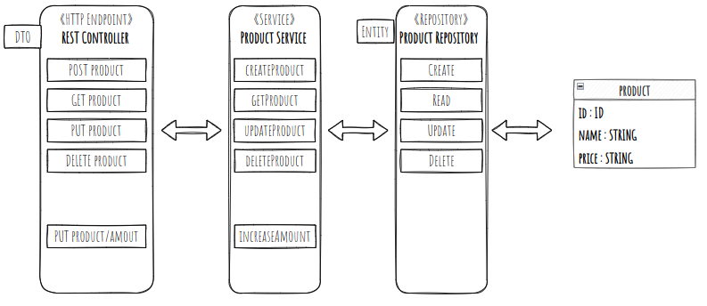

# Rest API

| Akce | HTTP metoda | Routa | Návratová hodnota |
| --- | --- | --- | --- |
| Create | POST | /entities | Vytvořená Entita |
| Read all | GET | /entities | List<Entity> |
| Read | GET | /entities/${ID} | Entity |
| Update | PUT | /entities/${ID} | Updatovaná Entita |
| Delete | DELETE | /entities/${ID} |  |

